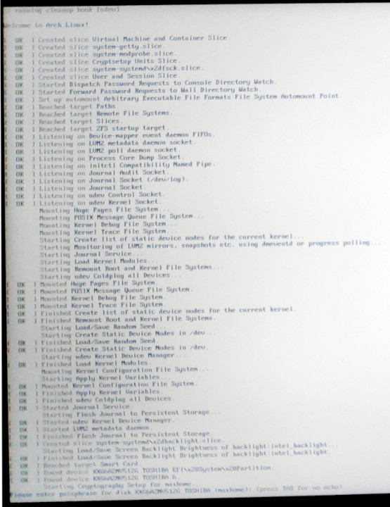

base16 for virtual terminals
============================

This repository can be used with any base16-builder to create base16 color
schemes compatible with `setvtrgb`

The color schemes can be applied during the early boot stage and there is a
initcpio hook for that. I can enter my encryption password with the color
scheme applied under Arch Linux. There is an
[AUR Package](https://aur.archlinux.org/packages/base16-vtrgb/) available.





Usage
-----

From a linux terminal (<kbd>Ctrl</kbd> + <kbd>Alt</kbd> +
[<kbd>F1</kbd>..<kbd>F12</kbd>])

```
cd /usr/share/kbd/consolecolors/
setvtrgb base16-tomorrow.vga
setvtrgb base16-tomorrow-night.hex  # for newer versions of setvtrgb
```

Installation
------------

I think that `/usr/share/kbd/consolecolors` would be a good path name to
install color schemes for the virtual terminal into, because `setvtrgb` comes
from the `kbd` package and the package already has other `console*` folders
there.

I have also prepared an initcpio hook for Arch Linux under `initcpio/`. The hook
uses `/etc/vtrgb` as its configuration file and this file can also be a symlink
to a color scheme from the before mentioned folder. I have successfully tried
the hook as first hook in my `/etc/mkinicpio.conf`. The name `/etc/vtrgb` I
have chosen, because I found that file to be part of modern Ubuntu installations
and it contains color scheme information there as well. By doing that I hope
that my packages will be compatible across distributions, but we will see.


Installation of the AUR package
-------------------------------

Under Arch Linux it is exceptionally easy to use console colors. The
installation could be as simple as:

```
yay -S base16-vtrgb
sudo ln -sf /usr/share/kbd/consolecolors/base16-papercolor-light.vga /etc/vtrgb
```

Add the `setvtrgb,consolefont` as HOOKS in `/etc/mkinitcpio.conf` and recreate
your initramfs with:

```
vim /etc/mkinitcpio.conf
/HOOKS

[...]
HOOKS=(setvtrgb consolefont base udev modconf block keyboard zfs filesystems)
[...]
:wq

mkinitcpio -p linux
```

If using `systemd` and `sd-vconsole`, use the `sd-setvtrgb` service hook instead:
```
vim /etc/mkinitcpio.conf
/HOOKS

[...]
HOOKS=(base systemd sd-setvtrgb sd-vconsole modconf block keyboard zfs filesystems)
[...]
:wq

mkinitcpio -p linux
```

Issues or Contributions
-----------------------

Please follow the [GitHub guide](https://guides.github.com/activities/contributing-to-open-source/).


Thanks
------

- @chriskempson for the [base16 project](https://github.com/chriskempson/base16)

- @InspectorMustache for
  [base16-builder-python](https://github.com/InspectorMustache/base16-builder-python)

- all other contributers :)
